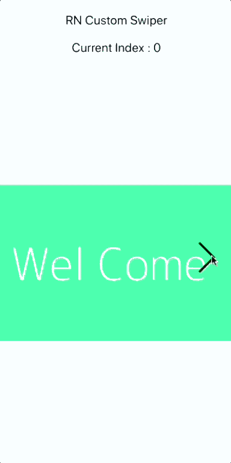

<p align="left">
  <a href="https://www.npmjs.com/package/react-native-custom-swiper"></a>
  <a href="https://www.npmjs.com/package/react-native-custom-swiper"></a>
  <a href="https://www.npmjs.com/package/react-native-custom-swiper"<></a>
</p>

### React Native custom swiper using Flatlist

Use images or custom views for swiping, Please refer [this blog](https://www.logisticinfotech.com/blog/custom-swiper-react-native-flatlist/) to use this library.


# Installation
```
npm i react-native-custom-swiper
```



### Properties

#### Basic

| Prop               |                          Default                          |    Type    | Description                                     |
| :----------------- | :-------------------------------------------------------: | :--------: | :---------------------------------------------- |
| swipeData          |                            []                             |  `array`   | Array of data which user want to show in swiper |
| renderSwipeItem    |                          ()=>{}                           | `function` | Create element of swiper                        |
| currentSelectIndex |                             0                             |  `number`  | Index of initial screen.                        |
| showSwipeBtn       |                           true                            |   `bool`   | For hide or show left/right button              |
| style              |                       Default style                       |  `object`  | Change swiper style                             |
| onScreenChange     |                       (index) => {}                       |   `func`   | Function call when screen changed               |
| leftButtonImage    |  Default left Arrow source {required("leftArrowString")}  |  `string`  | Modify left arrow image                         |
| rightButtonImage   | Default right Arrow source {required("rightArrowString")} |  `string`  | Modify right arrow image                        |
| containerWidth     |                       Screen width                        |  `number`  | Customize swiper screen width                   |
| backgroundColor    |                          "white"                          |  `string`  | Customize swiper background color               |
| autoplay           |                           true                            |   `bool`   | Change slide index automatically                |
| autoplayTimeout    |                           2500                            |  `number`  | Delay between every slide (in Second)           |
